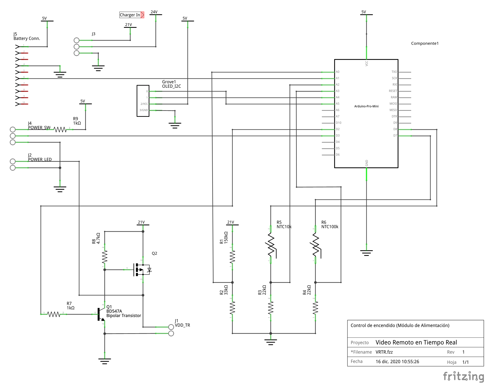
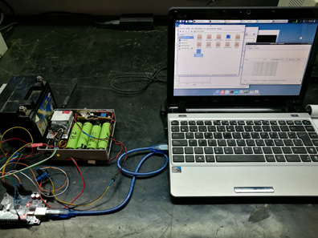

# VRTR #

[](README.md)
[]()

 Firmware for power control in the 'Capture and Send' device.

 &nbsp;

 ## Introduction

Most modern weapon systems have a monitor to display information from the optical sensors they incorporate. In many cases, these optical systems are highly accurate and specialized, such as infrared and thermal sensors. The possibility of having remote video without limiting movement offers endless possibilities.

Seeing from a distance what the operator of a weapon system is seeing in real time is a privilege and a breakthrough in technology. This is where the video remote real time system (VRTR system) comes into play.

The project is based on being able to capture images from any optical sensor and have those images available remotely, transmitting them wirelessly to the station that will process them.

Once the images or video have been captured, they are broadcast over a Wi-Fi network using streaming technology.

The code controls the behaviour of the microcontroller to turn the 'Capture and Send' module on or off, monitors battery voltage and consumption, and temperatures.

 &nbsp;

 ## License
```
_______________________________________________________________________
|                                                                     |
|  No part of this work may be distributed, reproduced, copied,       |
|  stored in a retrieval system, or transcribed in any form or        |
|  by any means, electronic or mechanical, beyond the terms of the    |
|  License.                                                           |
|                                                                     |
|  This code is distributed "as is" without warranty of any kind,     |
|  including warranties of merchantability, fitness for a particular  |
|  purpose, or fitness for a particular purpose.                      |
|                                                                     |
|  The author shall not be liable for any damages of any kind arising |
|  out of the use, including loss of business or loss of data.        |
|_____________________________________________________________________|
```

This file is part of VRTR Project.

VRTR Project is free software: you can redistribute it and/or modify it under the terms of the GNU General Public License as published by the Free Software Foundation, either version 3 of the License, or
(at your option) any later version.

VRTR Project is distributed in the hope that it will be useful, but WITHOUT ANY WARRANTY; without even the implied warranty of MERCHANTABILITY or FITNESS FOR A PARTICULAR PURPOSE.  See the GNU General Public License for more details.

You should have received a copy of the GNU General Public License along with VRTR Project.  If not, see <https://www.gnu.org/licenses/>.


[](LICENSE)

## Authors

Copyright © 2019-2022 Francisco Rafael Reyes Carmona.
Contact me: rafael.reyes.carmona@gmail.com

## Credits

Vod icon at the beginning is from [Flaticon.es](https://www.flaticon.es) designed by [Freepik](https://www.flaticon.es/autores/freepik) and licensed by [free license](images/license.pdf).